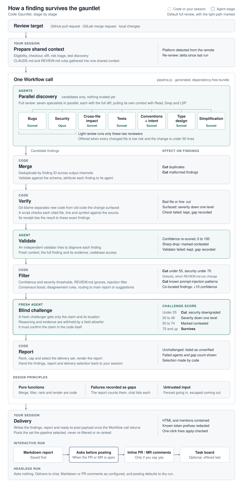

# How Code Gauntlet works

The [README](../README.md#how-it-reviews) gives the overview.
This diagram follows one finding through every stage, and shows what each stage does to it and whether code or an agent runs it.

<picture>
  <source media="(prefers-color-scheme: dark)" srcset="assets/pipeline-detail-dark.svg">
  
</picture>

The thresholds shown are defaults, which a [`REVIEW.md`](../skills/code-gauntlet/references/review-md-spec.md) can change.
[CONTRIBUTING.md](../CONTRIBUTING.md) maps the stages to the source files.
